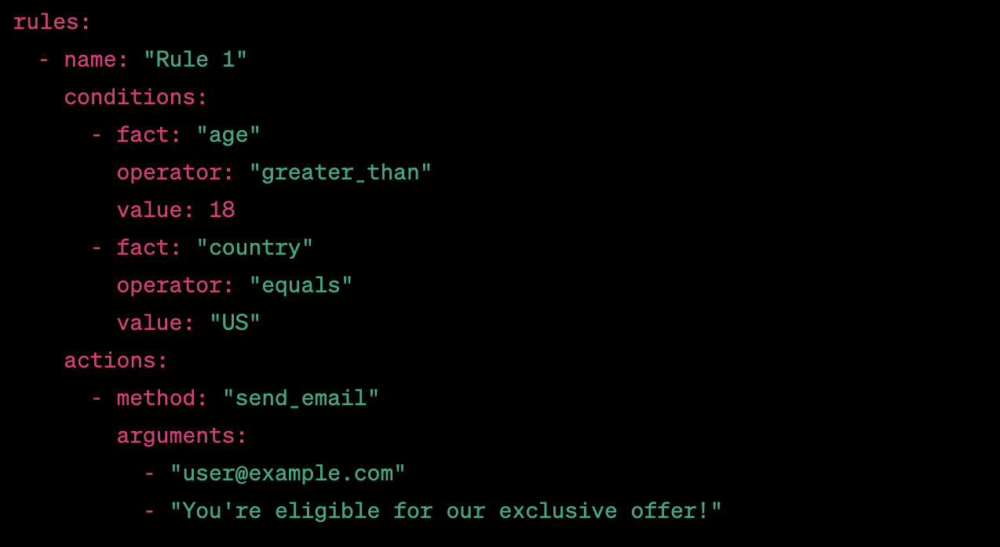

# Tako
Tako is a lightweight rule engine written in Ruby that allows you to define and execute business rules in a YAML format.
## Installation
Add this line to your application's Gemfile:
```ruby
gem 'tako'
```
then execute
```ruby
$ bundle install 
```
Or install it yourself as:
```ruby
$ gem install tako
```
## Usage
First, define your rules in a YAML file. Here's an example:



In the example above, we have defined two rules, each with a set of conditions and actions.

To execute your rules, you need to create an instance of the **Tako::Engine** class,
passing in the path to your YAML file. You can then call the **execute** method,
passing in a hash of facts, which will be used to evaluate the conditions of each rule.
```ruby
require 'tako'

engine = Tako::Engine.new("path/to/your/rules.yml")

facts = {
  "age" => 25,
  "country" => "US"
}

engine.execute(facts)

```

In the example above, we have created an instance of the Tako::Engine class and passed in the path to our YAML file. We have also defined a hash of facts, which will be used to evaluate the conditions of each rule. We then call the execute method on the engine instance, passing in our facts.

If any of the rules evaluate to true, the actions defined in the rule will be executed.

## Contributing
Bug reports and pull requests are welcome on GitHub at https://github.com/nestorbenavidez/tako. This project is intended to be a safe, welcoming space for collaboration, and contributors are expected to adhere to the code of conduct.

## License
The gem is available as open source under the terms of the MIT License.

## Running Tests
To run tests, install dependencies and run rspec:

```ruby
$ bundle install
$ rspec
```


